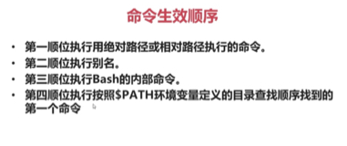

### 1.你设置的alias当你退出登录或者注销以后就会失效
我们可以写入到环境变量中就可以了：
```bash
vim ~/.bashrc
#这是root用户的，其他用户如user1在~/home/user1/.bashrc,而user2在
#~/home/user2/.bashrc，从而对每一个用户都有一个配置文件
#添加命令后我们为了让它直接生效，我们可以执行下面命令
source .bashrc
#如果没有这句话要重新登录后才能生效
```
删除别名直接通过`unalias`就可以了！但是命令行直接unalias只是`临时删除`，如果配置文件.bashrc中还有,那么下次还会生效，所以要手动删除！

### 2.命令生效的顺序
如果我们有下面的命令：
```bash
alias rm='rm -i'
#用户自己定义的rm，但是还有系统默认的rm啊
```
那么我们的顺序如下：



### 3.$PATH
该变量的内容是通过冒号分割的一系列路径，当我们输入某一个命令的时候，其实就会在这些路径中找相应的`bin`目录下是否存在这个命令。其内容如下：
<pre>
bash: /c/Users/Administrator/bin:/mingw32/bin:/usr/local/bin:/usr/bin:/bin:/mingw32/bin:/usr/bin:/c/Users/Administrator/bin:/c/Windows/system32:/c/Windows:/c/Windows/System32/Wbem:/c/Windows/System32/WindowsPowerShell/v1.0:/c/Program: No such file or directory
</pre>
