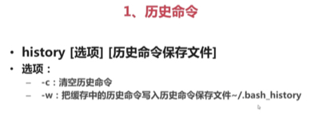

### 1.历史命令保存位置
下面给出历史命令的用法



历史命令默认只是保存1000条，你可以在/etc/profile中修改下面的配合：
```bash
HISTSIZE=1000
#修改这个配置就可以了
```

### 2.快捷键


我们也可以通过tab键进行命令的自动补全，如果按了一次tab命令没有补全，表示有多个以该字符开头的`命令(命令补全，与$PATH相关)或者路径(路径补全)`，那么继续按一次tab就可以了 