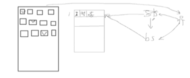
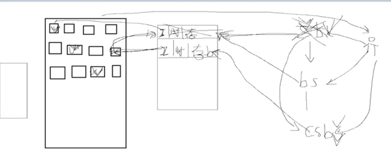
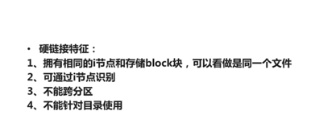
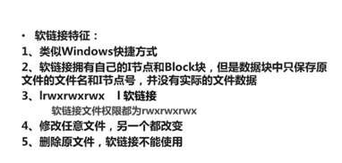

### 1.linux的主要发行版本
所谓的发行版本，他们之间的内核(kernel)是完全一样的，都是由linux官网来维护的，只是不同厂商做了一定的其他处理。主要有以下:


其中ubuntu和其他厂商发行的版本在内核上是完全一样的，只是它包含了图形界面，因此更加占用内存，一般并不会用于服务器(安全性与稳定性都不高)。服务器主要使用的是redhat，但是redhat包含一些收费的售后服务，而相对而言我们的centos是完全免费的，而且内核和redhat也完全一样。

### 2.硬链接
#### 2.1 通过shell命令查看i节点与硬链接磁盘空间占用翻倍
在查找系统中文件的时候，我们先会查找一个`文件索引表`，然后根据索引表去硬盘中查找。如下图：



硬链接就像是教室的两个门，不管从那个门进入最后都会是同一个教室。而且不同的硬链接指向的文件索引表中的对象具有`相同的i节点与block块`，删除任何一个硬链接，剩余的硬链接依然能够打开(因为他们引用的是同一个文件),但是前提是必须在同一个分区，形象的说就是`同一栋楼`！你也可以从上面的图中看出。我们可以通过下面的命令来查看i节点：
```bash
ln commonError.md e.md 
ll -i -h
#-i表示查看i节点，h表示human readable，也就是使用20k等大小
```
此时你看到在我的shellGlobStar中运行该命令后得到的结果如下:
<pre>
 total 51K
1688849860445007 -rw-r--r-- 2 Administrator 197121 471 四月  7 09:04 commonError.md
1688849860445007 -rw-r--r-- 2 Administrator 197121 471 四月  7 09:04 e.md
3377699720668628 -rw-r--r-- 1 Administrator 197121 541 四月  8 11:32 for.sh
1407374883695985 drwxr-xr-x 1 Administrator 197121   0 四月  5 17:22 node_modules/
2814749767292893 -rw-r--r-- 1 Administrator 197121 37K 四月  8 13:16 readme.md
5066549580932128 drwxr-xr-x 1 Administrator 197121   0 四月  8 12:20 src/
</pre>
第一列表示该文件的i节点(你可以清楚的看到源文件与硬链接指向的i节点是`完全一致的`)，第二列表示权限(如果是软连接那么第一个字符是`l`,而此处硬连接你可以看到其和普通文件是一样的，这可能也是为什么`删除了源文件后硬链接依然可用，但是软连接不可用的一个表现`),第三列表示该文件的引用次数(因为我为commonError.md添加了硬连接，其文件名为e.md，所以你看到e.md与commonError.md的引用次数都是2，也就是硬链接和源文件的引用次数会同时增加,因为硬链接最后指向的是硬盘中的文件，所以此处表示有两个指针指向硬盘中的文件而已，`删除的时候你会发现另外一个文件的引用次数也会相应减少`)，第四列表示文件的所用者，第五列[表示用户id](http://blog.csdn.net/zhangxuechao_/article/details/45333319)($UID,echo `id -u`,或者直接打印`id`获取到gid,uid,groups所有内容)，第六列表示文件大小(commonError.md与e.md都是471字节)。其他列都比较容易理解。你也可以通过下面的命令来仅仅查找i节点：

```bash
ls -i
```
此时结果如下：
<pre>
1688849860445007 commonError.md  1407374883695985 node_modules/
1688849860445007 e.md          2814749767292893 readme.md
3377699720668628 for.sh          5066549580932128 src/
</pre>
通过这个输出，你可以看到每一个文件和目录的`i节点`。我们可以发现，硬链接和源文件的大小完全是一致的!硬链接个人感觉用处不大，因为创建硬链接是`磁盘上空间是增加了双倍，你可以通过右键看到e.md与commonError.md两个文件其实占用了双份空间`，但是对于硬链接而言，修改硬链接文件和原始文件的内容都会相互影响。这也是硬链接与普通文件之间唯一的区别把！

#### 2.2 深入分析硬链接
<pre>
linux系统下的文件包括`i_node`结构和`data`两部分，其中i_node结构中有两个引用计数i_count和i_nlink，前者记录该文件当前的使用者数量，后者记录该文件的介质链接数量，即前者针对`内存`，后者针对`硬盘`，只有这两个引用计数值都为0的情况下，data的删除才真正进行。
所以，一个文件没有创建相应的硬连接时、和创建了相应的硬连接时，rm命令执行的结果是不一样的；
</pre>
其中创建了硬链接后，我们删除了源文件，那么我们的硬链接依然可以正常使用，仿佛源文件没有被删除一样（因为源文件还有硬链接指向它），而软连接在这种情况下就失效！比如我们删除commonError.md这个源文件，然后看看err.md这个硬链接的情况：
```bash
 rm -rf commonError.md
 #此时源文件已经删除
 ll -i -h
```
此时得到下面的结果：
<pre>
total 47K
4785074604271084 -rw-r--r-- 1 Administrator 197121 471 四月  9 10:06 commonError1.md
1688849860445007 -rw-r--r-- 1 Administrator 197121 471 四月  7 09:04 err.md
3377699720668628 -rw-r--r-- 1 Administrator 197121 541 四月  8 11:32 for.sh
1407374883695985 drwxr-xr-x 1 Administrator 197121   0 四月  5 17:22 node_modules/
2814749767292893 -rw-r--r-- 1 Administrator 197121 37K 四月  8 13:16 readme.md
5066549580932128 drwxr-xr-x 1 Administrator 197121   0 四月  8 12:20 src/ 
</pre>
此时你发现commonError1.md已经移除了，但是我们的硬链接err.md依然可以正常使用(cat命令可以查看内容)！原因在于：`虽然我们对commonError1.md执行了rm -rf操作，但是因为我们的硬链接依然指向它，所以其引用次数没有变化为0，故而没有真正从硬盘中删除。此种情况下硬链接依然可以找到，只是软连接无法找到而已！`这也是[官网](https://ss64.com/bash/ln.html)给下面例子的说明：
```bash
 ln file1.txt link1
 rm file1.txt         
#The file cannot be deleted until the link is removed.
#只有当link文件删除后才能真正从硬盘中删除源文件
```

### 3.软连接创建，大小，与失效
首先windows上git bash的`ln`命令无法创建软连接的，只是对源文件的一个复制而已,所以我们可以使用windows上的mklink来完成！命令如下(在cmd中运行):
```bash
mklink error.md commonError.md
#为commonError.md创建一个软链接error.md，链接文件在前，和ln参数顺序有差异
#在cmd中输入为: error.md <<===>> commonError.md 创建的符号链接
```
此时我们运行`ls -aihl`得到如下的结果：
<pre>
 total 94K
127508164450063745 drwxr-xr-x 1 Administrator 197121   0 四月  9 11:15 ./
   562949953421669 drwxr-xr-x 1 Administrator 197121   0 四月  9 09:21 ../
 10414574138434611 drwxr-xr-x 1 Administrator 197121   0 四月  8 16:44 .git/
  4785074604271084 -rw-r--r-- 3 Administrator 197121 471 四月  9 10:06 commonError.md
  4785074604271084 -rw-r--r-- 3 Administrator 197121 471 四月  9 10:06 e.md
  9570149208351226 lrwxrwxrwx 1 Administrator 197121  14 四月  9 11:15 error.md -> commonError.md
  3377699720668628 -rw-r--r-- 1 Administrator 197121 541 四月  8 11:32 for.sh
 25051272927384877 -rw-r--r-- 1 Administrator 197121 541 四月  8 11:32 for1.sh
  1407374883695985 drwxr-xr-x 1 Administrator 197121   0 四月  5 17:22 node_modules/
  2814749767292893 -rw-r--r-- 1 Administrator 197121 37K 四月  8 13:16 readme.md
  5066549580932128 drwxr-xr-x 1 Administrator 197121   0 四月  8 12:20 src/
</pre>
你可以看到硬链接e.md与源文件commomError.md大小一致，而软连接为`14字节`,明显比源文件小很多！同时软连接给出了目标文件的地址：
<pre>
lrwxrwxrwx 1 Administrator 197121  14 四月  9 11:15 error.md -> commonError.md
</pre>
所以，当你移动了源文件后，软连接也就失效了！


### 3.软连接vs硬链接的区别
(1)软链接也有硬链接没有的缺点，因为`链接文件包含有原文件的路径信息`，所以当原文件从一个目录下移到其他目录中，再访问链接文件，系统就找不到了～～，而硬链接就没有这个缺陷，你想怎么移就怎么移（呵呵）；还有它要系统分配额外的空间用于建立新的索引节点和保存原文件的路径。

(2)软链接克服了硬链接的不足，`没有任何文件系统的限制`，任何用户可以创建指向目录的符号链接。因而现在更为广泛使用，它具有更大的灵活性，甚至可以`跨越不同机器`、`不同网络`对文件进行链接。

(3)关于 I节点的问题 。硬连接不管有多少个，都指向的是同一个I节点，会把 结点连接数增加 ，只要结点的连接数不是 0，文件就一直存在 ，不管你删除的是源文件还是链接的文件 。只要有一个存在 ，文件就存在 （其实也不分什么 源文件连接文件的 ，因为他们指向都是同一个I节点）。 当你修改源文件或者连接文件任何一个的时候 ，其他的文件都会做同步的修改 。软链接`不直接使用i节点号作为文件指针,而是使用文件路径名作为指针`。所以 删除连接文件对源文件无影响，但是删除源文件，连接文件就会找不到要指向的文件 。软链接有自己的inode,`并在磁盘上有一小片空间存放路径名`

(4)软连接可以对目录进行连接

你可以查看下图：



软连接自己的i节点指向的文件原本的I节点，这是为什么我们软连接在硬盘中占据的空间要小很多！



上面是硬链接的特点



该图给出了软连接的特点，其中注意一点软连接的权限不是777，而是与原来链接的文件的权限相关。同时，我们在链接的时候注意一般还是使用`绝对路径`~


参考资料：

[ Linux "ls -l"文件列表权限详解](http://blog.csdn.net/jenminzhang/article/details/9816853)

[ linux 链接的使用 创建和删除符号连接（软、硬链接）](http://blog.csdn.net/shaobingj126/article/details/6950892)

[linux的问题](http://tieba.baidu.com/p/4763815009)

[Windows 使用 ln -s 创建软链接](https://segmentfault.com/a/1190000002498633)

[Win7中的软链接详解（mklink命令）](http://blog.csdn.net/zht666/article/details/45917155)

[bash ln](https://ss64.com/bash/ln.html)