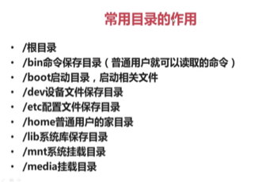
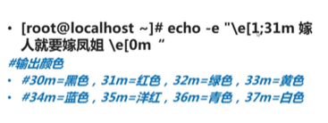

### 1.linux下的目录作用
<pre>
(1)/sbin,/usr/sbin下的命令（系统命令）root用户才能允许,其中s表示`super`
(2)/etc系统默认的配置文件
(4)lib表示linux中函数库的保存位置。操作系统并不是将所有的功能都写在linux中，常用功能写成了一个个的程序库，这些库保存在lib下，需要的时候调用。而不是全部写在linux中从而使得它变得无比庞大，而且缓慢
(5)misc,mnt(光盘，老式系统没有其他两个),media:存储设备都要挂载后使用，但是挂载需要空目录。系统准备的空目录，用于外接存储设备的盘符。
(6)proc,sys：不能直接操作，保存的是内存的过载点，其中的数据直接写在内存中
(7)dev设备文件保存目录
(8)可以操作的目录：
管理员：root,tmp目录
普通用户：home,tmp目录
根目录：root可以，但是不推荐，影响文件查找速度
</pre>
下面给出一个图:



### 2.linux中的颜色值与命令执行
```bash
#!/bin/bash
#(注意)上面这句话一般不能删除，在shell中如果调用了其他语言，那么如果没有这句代码那么就是会
#报错的，如果没有调用其他语言，那么是可以没有上面这句就会报错
echo -e "输出开始:\n"
echo -e "\e[1;36m 这是shell脚本内容 \e[0m" 
echo -e "输出结束了"
#(2)首先ctrl+C然后通过:wq即可
#(3)通过bash ./vi.sh直接运行脚本，或者通过下面的两句命令来完成:
#chmod 755 ./vi.sh;./vi.sh
#通过输入`i`字符可以快速切换到insert模式
```
其中每一个颜色的具体值你可以查看下面的图。



同时这里也给出了两个直接执行命令的方式，第一个就是直接通过bash完成，第二个就是先修改权限然后直接执行!
