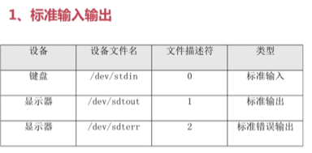
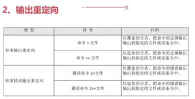
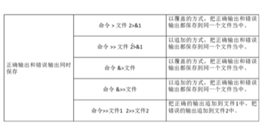
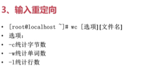

### 1.输入输出设备
下面给出一个表格：



其中`文件描述符为0表示键盘，而1表示标准正确输出，而2表示标准错误输出`。linux中一切都是文件，而文件名本身不好记忆，所以才有了文件描述符！下面是标准输入输出的图表。




如下面的例子：
```bash
datec 2>>test.log
#但是我们的datec命令不存在，但是我们的log中会存在这个错误信息
#即command not found!
```
注意：正确内容输出`>`或者`>>`左右两侧有空格，而错误输出`>`或者`>>`两侧没有空格!但是只是输出错误内容显然是没有意义的，所以我们需要最后一种方式将错误信息和正确信息同时保存！其格式如下：
<pre>
    命令 >> 文件 2>&1
</pre>
表示，如果命令结果为正确的那么我们写入到文件中;而如果报错，那么我们将错误信息(`2表示错误信息，而1在shell中表示正确信息`)也输出到文件中。
```bash
ls &>/dev/null
#将ls产生的信息全部放到垃圾袋，也就是不显示了
```
下面是保存错误信息与正确信息的其他方式：



### 2.输入重定向之wc(crtl+d退出)
不过这种输入重定向的方式非常少，这里不说了。具体用法参见下面的图：

