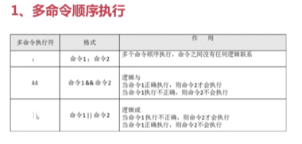

### 1.符号分割的多个命令之间关系
逗号表示：任何一个命令出错都不会影响其他命令。见下图：



&& :两个逻辑命令之间有逻辑与关系

|| :逻辑或运算符

通过下面这种方式可以获取到命令是否正确执行,而不用关注每一条命令的执行结果：
```bash
ls && echo yes || echo no
```


### 2.管道符
命令1的正确输出作为命令2的输入，如果命令1报错，那么命令2不会执行。见下图：

